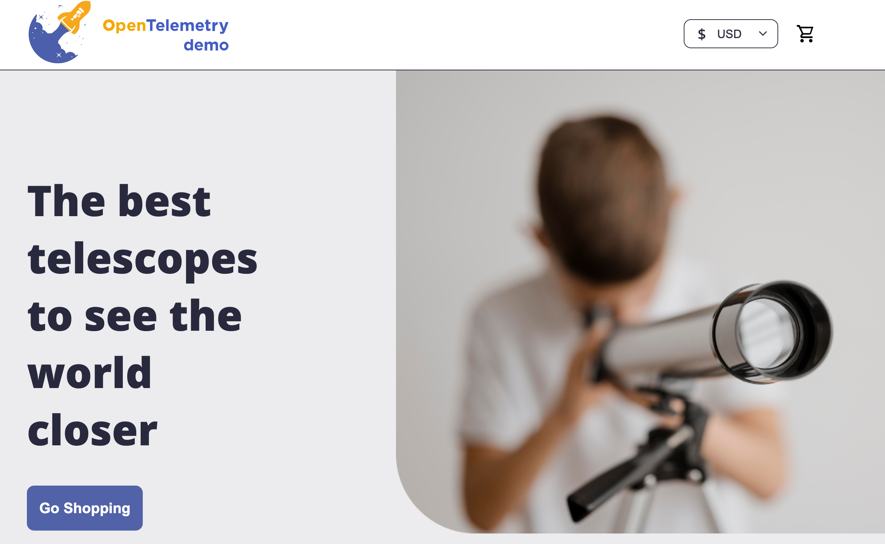
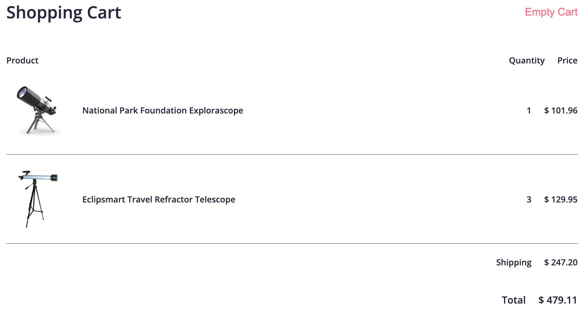
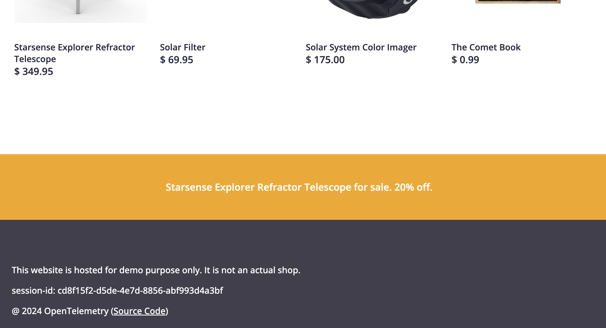
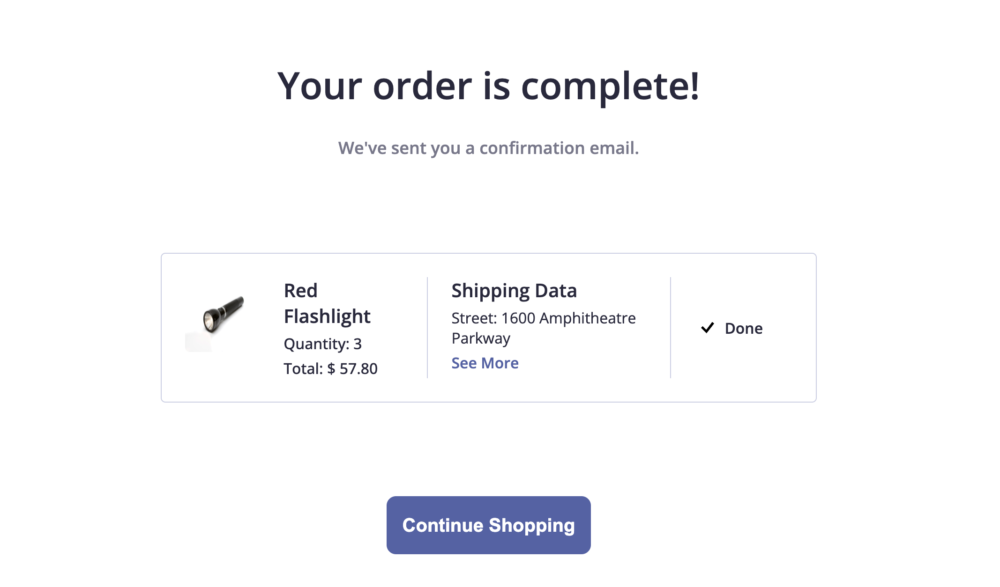
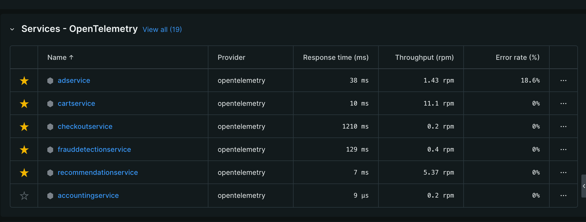

# From Observation to Action: Exploring Debugging with New Relic
With today's workshop, you'll gain an understanding of how observability helps software engineering teams to understand the health and performance of their systems.

Through today's presentation and hands-on exercises, you'll explore observability and will learn how these practices enable engineers to gain insights into the inner workings of their applications, diagnose issues effectively, and make informed decisions to enhance performance and reliability.

## Using New Relic for Debugging
We'll be viewing the data we receive from the Astro Shop application today on New Relic, an all-in-one observability platform that allows us to view telemetry data from different services and infrastructure.

## About OpenTelemetry
OpenTelemetry is an open source framework that's helping us rethink observability at the instrumentation level, by standardizing how our application data is generated, collected, and shipped.

Today we'll be using the OpenTelemetry Astro Shop app to learn about the core pillars of observability. To learn more about OpenTelemetry, check out Reese Lee's workshop, _What's Wrong With My App?: Using OpenTelemetry To Observe Your Code_ on June 14th at 10am.

## Setup Instructions
### First, create your free New Relic account [here](https://newrelic.com/signup).
- If you are currently verified through GitHub Education as a current student, log into your New Relic account and go to **Help > Resources > New Relic for Students > Manage Account Eligibility > GitHub Education** to allow New Relic to verify your student status. Additional data and ingest from the [New Relic for Students](https://newrelic.com/students) program will be automatically added to your account.
- If you're not currently registered as a GitHub Education student, please go [here](https://education.github.com/pack) to sign up. Once you've been successfully verified as a student, you'll be able to follow the steps above to receive the New Relic for Students Benefits.

### Fork this repository! (Please do not clone)
- Click on `Code`, then `Create Codespace on main`
### Add your New Relic license key to your application
- In your New Relic account, click on your name, then click on API Keys
- Under Type, find the key that says `INGEST - LICENSE`, click on the three dots at the end of the row, and click `Copy key`
- Paste your New Relic license key in the `otel-config-extras.yml` file under `exporters: api key`

You're ready to run your application!
## Running the application
Run the `docker compose up` command.

## Stopping the application
Stop the Codespace

## The Task
I'm looking to purchase some items and have them delivered in time for the next meteor shower this year so I can see all of the shooting stars! However, as I navigate the application, I am noticing that special deals are not being applied to select items, and I am not getting the correct total as I go to complete my purchase. I want to use New Relic and view the data that is coming in from the application so I can fix the bugs and have my order shipped.

### Step 1: Add items
Choose any 2 items from the Astro Shop and add them to your cart. For your second item, add multiple quantities of the items.

### Step 2: Add item from an 
Scroll to the bottom of an item's information page, you should see an ad for a discount off of one item. Click on the ad and then add that item to your cart.

### Step 3: Proceed to checkout
Feel free to enter whatever shipping information you want, or keep what's there. Enter the following card information under Payment Method:
- Credit Card Number: 4432-8015-6152-0453
- Expiration Date: January 2028
- Security Code: 060

### Step 4: Click on Place Order

This is the page that I should see after I click the Place order button, but I do not! This is what we should see after we do some debugging today.

### Step 5: Check your New Relic account
 In your New Relic account, you should see a list of 19 services with `opentelemetry` listed as the provider. This is how you know you've instrumented your application with New Relic correctly.

If you don't see this data appear in your New Relic account within a few minutes, review the setup instructions.

## Today's Scenarios

- It looks like the discounts being promoted in the ads are not being applied to the items in the cart at checkout. Which data type(s) could I look at to view the problem, and how do I solve it?
- I'm not sure how the shipping is being calculated, as the total is rapidly increasing if I have more than one item in my cart. I want to change it to be a fixed price of $10. How would I change the shipping, and which service and data would I use to solve any errors produced with the change?
- We learned that microservices, while running independently, are all connected to help run our applications. If I wanted to complete the checkout process, which services, from viewing the items I placed in my cart to payment completion, are working together? Take a screenshot of a Service Map to show the connection, and take a look in the Errors Inbox to see if you can find the problem.

## Resources
[Get Started with New Relic](https://docs.newrelic.com/docs/new-relic-solutions/get-started/intro-new-relic/)

[Getting Started with APM](https://docs.newrelic.com/docs/apm/new-relic-apm/getting-started/introduction-apm/)

[Introduction to OpenTelemetry with New Relic](https://docs.newrelic.com/docs/more-integrations/open-source-telemetry-integrations/opentelemetry/opentelemetry-introduction/)

[New Relic for Students](https://newrelic.com/students)
